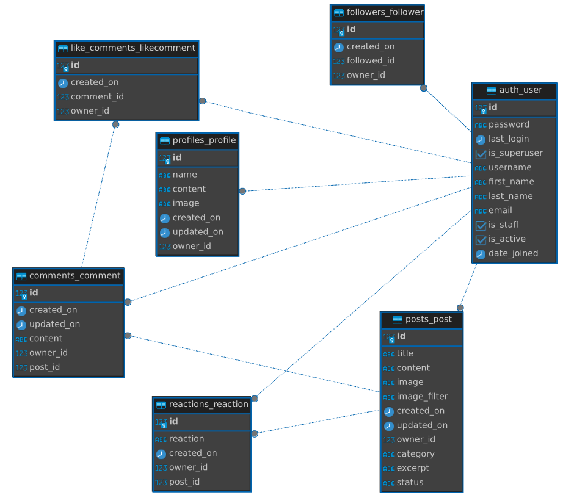
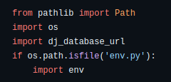
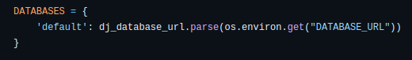

# Creature Feature

## **Project Overview**

Creature Feature is a quirky and fun interactive photo-sharing app dedicated to our often smaller - but by no means lesser - animal companions. Although it shares its name with the famous horror/sci-fi genre of films known as 'Creature Features', the creatures featured on this platform are anything but spooky… Unless they want to be, of course! That said, despite the cutesy aesthetic this app employs, the spirit of the genre is subtly kept alive through the unusual names of the post categories users must pick from to let the world know what type of creature it is they’re featuring! The thematic combining of the _’creepy & kooky’_ with the charming & adorable provides a truly distinctive, engaging platform for users to _sink their claws into_.

The Creature Feature API is the back-end portion of the Creature Feature app, and has been developed using Django's REST Framework. The app aims to provide users with the ability to share pictures of their pets and/or favourite animals with other like-minded users, build up a profile and follow other profiles they enjoy. This API has been created to ensure that users can enjoy a smooth and seamless user experience, by providing the front-end app with the core functionality it needs.

To view the deployed API, [**_please follow this link_**](https://creature-feature-api-43ea2b93451a.herokuapp.com/).

This is the back-end repository for this project. To go to the front-end repository, [**_please follow this link_**](https://github.com/emmacadavra/creature-feature-react).

To view and explore the deployed Creature Feature front-end app, [**_please follow this link_**](https://creature-feature-react-fb85071d4bc2.herokuapp.com/).

## **Table of Contents:**

1. [**Project Overview**](#project-overview)
1. [**Project Planning**](#project-planning)
   - [**Project Aims (API)**](#project-aims-api)
   - [**User Stories**](#user-stories)
1. [**Database Schema**](#database-schema)
   - [**Data Models**](#data-models)
   - [**API Endpoints**](#api-endpoints)
1. [**Technologies Used**](#technologies-used)
1. [**Testing**](#testing)
1. [**Deployment**](#deployment)
1. [**Credits**](#credits)
   - [**Honourable Mentions**](#honourable-mentions)
   - [**Code and Content References**](#code-and-content-references)

## **Project Planning**

### **Project Aims (API):**

- To provide the front-end app with a robust back-end counterpart that allows communication between React/JavaScript and Python.
- To implement user authorisation through the use of Django AllAuth and Django Rest Auth, allowing users to create accounts, login and logout on the front-end
- To provide CRUD functionality to users on the front-end in relation to posts and comments:
  - Logged in users can create, edit and delete their own posts.
  - Logged in users can create, edit and delete their own comments.
  - Logged in users can choose one of three reactions to any post that is not their own, and they can change or undo these reactions at will.
  - Logged in users can like any comment that is not their own, and unlike it at will.
- To provide CRUD functionality to users on the front-end in relation to their profiles and following other profiles:
  - Logged in users can edit their own profile by uploading a profile image and amending their profile's content whenever they wish.
  - Logged in users can follow the profiles of other users, and unfollow at will.
- To provide the front-end with a number of options that allow logged in users to control the posts they see, by applying filters (such as posts by category, only showing posts by users they follow, or viewing the posts they have reacted to) or using the search bar to search for posts that use specific keywords, or are by specific profiles.
- To allow logged out users to view posts, though without access to post filters or the ability to create, edit or delete posts.

### **User Stories**

The User Stories for this project can be accessed by following this link to [**_the front-end repository’s project board_**](https://github.com/users/emmacadavra/projects/5). Further information on these User Stories an be found in the separate [**_AGILE.md document_**](https://github.com/emmacadavra/creature-feature-react/blob/main/AGILE.md), also within the front-end repository.

## **Database Schema**

Below is a diagram that provides a visual overview of the database tables for this project (created using [**_dBeaver_**](https://dbeaver.com/)):

### **Data Models**

#### **User**

The User model is provided by Django AllAuth, and enabled users to create accounts with a username and password, providing validation and assigning each profle a unique primary key.

#### **Profile**

The Profile model creates a new user profile whenever a new instance of the User model is created. This is possible thanks to the 'create_profile' function within the model. Once created, users are able to update their profile name, its content, and upload a profile image.

#### **Follower**

The Follower model allows logged in Users to follow or unfollow other Users on the front-end. A 'follow' equals the creation of a new Follower instance, whereas an 'unfollow' deletes that instance from the database. A User can only have one unique Follower ID per user followed, preventing Users from being able to follow the same person multiple times.

#### **Post**

The Post model centres around what is arguably the most important part of the Creature Feature app - the ability for users to create, read, update* and delete* (\*if they are the post owner) posts. In addition to the basic expected functionality (such as title, content, image), I have added 'category' as a field, for which there are three choices. These are in line with the overall intention for this app, which is -literally- to feature creatures! I felt that users would appreciate being able to select which variety of creature it is they're featuring, and it also enables users to filter posts based on these categories.

Another custom feature of the Post model is the inclusion of the PostObjects Manager model. A currently hidden feature of the Post model is that it provides users with the ability to store posts they may want to come back to edit later before posting as drafts - this is handled by the PostObjects Manager, and the subsequent 'objects' and 'post_objects' fields. The 'status' field in Post dictates that, by default, all posts are set to 'published' and therefore will appear in any and all searches. Unfortunately at the time of deployment, this feature has not been fully implemented yet, hence being a currently hidden feature. In the Post model, there is a field called 'excerpt' which comes from the same line of thinking as the 'published'/'draft statuses, though it is not being utilised. I had attempted to remove this field later into development, but unfortunately this caused significant issues with loading the existing data due to the field being part of the individual Post instances. While currently operating as a single image sharing site, I would like to expand on this in future to implement more blog-like qualities, and create a sort of blog/photo-sharing hybrid. Although I removed 'excerpt', I have decided to keep the PostObjects Manager and the status field where it is, so that I can begin working on this in the near future.

#### **Reaction**

The Reaction model is a custom model that looks after what I would consider to be the most unique and interesting aspect of this app - the ability to 'react' (no pun intended, but welcome all the same) to posts with one of three choices. Each choice is intentionally very cute, and deviates from what users might have come to expect, so it jumps out as a unique selling point. However, users can only select one of the three at a time, and the 'unique_together' field in the model's Meta class takes care of this. The front-end relies on the information received by the Reaction model to perform conditional rendering of the reaction elements based on the user's logged in state, whether they are the owner of the post, and of course which reaction they have chosen.

#### **Comment and LikeComment**

The Comment model enables users to create, read, update* and delete* (\*if they are the comment owners) comments on individual posts. Comments are linked to both posts and profiles, as users are able to access a user's profile by following the link provided through the comment.

The LikeComment model is more in line with what users might usually expect with a social media app like this one, and it operates in a much simpler fashion to the Reaction model. When a user creates a comment, The comment ID is created, which is linked to the post ID. When a user who does not own that comment wishes to 'like' it, the model creates a new LikeComment instance, taking the comment ID (linked to the specific post ID), and then the profile ID of the user wishing to like the comment, rather than the profile ID of the user whose comment it is. If a user wants to undo this action (ie, delete the LikeComment instance), they can click the icon again to unlike it. The front-end uses this information to conditionally render the icon used to like the comment, based on whether a user has liked it or not.

#### **Pagination**

The Creature Feature API uses pagination as a way of preventing too much data from being loaded at once (causing problems for performance). A global rule is set to limit responses from the API to 10 per page, and it will provide links to the next page of 10 results. The use of infinite scroll on the front-end loads this data so that users don't have to click a 'next' button every time they've viewed 10 pages.

The only current exception to this is in Comments. The way I have designed the front-end React app meant that using the infinite scroll component for comments under posts was causing bugs that I struggled to find a sufficient solution to, and so I have had to remove it. As such, in comments/views.py there is a custom PageNumberPagination class which sets the maximum number of comments allowed in a single page to a much higher (and currently very unlikely) number, so that user experience is not ruined by comments and posts bugging out. This is something I wish to solve in future.

## **Technologies Used**

The language used to write this API is Python. Below is a list of the frameworks and libraries used to create this project, as well as other dependencies:

- Django - the Python framework used to develop this project.
- Django REST Framework - the Django toolkit that enabled the creation of this API.
- Django AllAuth - enabling user authentication and validation.
- Django Rest Auth - to provide endpoints for users to login/logout.
- ElephantSQL - to host the PostgresSQL database used by this project.
- Psychopg2 - a database adaptor that enables interaction between Python and PostgresSQL.
- Cloudinary - to host images and static files that engages seamlessly with the front- and back-end counterparts of this project.
- Pillow - an imaging library that adds image processing capabilities.
- Django Filters - to allow queryset filtering based on model fields.
- Django CORS Headers - to handle the server headers required for Cross-Origin Resource Sharing.
- Heroku - providing a platform in which to host the deployed project.
- dBeaver - a program I have relied on greatly throughout the development process to investigate the data that is being passed between my front- and back-end applications.

## **Testing**

A separate file has been created for information about testing. Please click the following link to access it: [**_TESTING.md_**](TESTING.md)

## **Deployment**

In this section I will explain the steps I took in order to deploy this project, so that they can be followed if you wish to clone this project and work on it yourself.

#### **Cloning/Forking**

If you wish to create a clone of this project to use on your local machine or virtual IDE environment such as Gitpod, first navigate to [this project's GitHub Repository](https://github.com/emmacadavra/creature-feature-drf-api), and follow [GitHub's instructions on how to clone a repository](https://docs.github.com/en/repositories/creating-and-managing-repositories/cloning-a-repository). If you are using a local environment, you can enter the following command in the terminal:
`pip install -r requirements.txt`
This will install all the required libraries and packages in one go, meaning you will not have to follow the set-up steps below.

As I developed this project locally, I first created a virtual environment using the command `python3 -m venv [your_venv_name]` - if you clone this project to use locally, you must do the same. Ensure that the virtual environment is not tracked by version control by adding it to the .gitignore file.

#### **Project Setup**

Below is a list of the steps and terminal commands I used to install the necessary libraries and packages for this project following the creation of the GitHub repository:

1. Create a virtual environment (as mentioned above):
   - `python3 -m venv [your_venv_name]`
   - IMPORTANT: Add the .venv file to .gitignore so that it is not tracked with version control.
1. Open the virtual environment and install Django with Gunicorn:
   - `source [your_venv_name]/bin/activate`
   - `pip install django gunicorn`
1. Install the following supporting libraries:
   - `pip install django-cloudinary-storage==0.3.0`
   - `pip install dj-database-url==0.5.0 psychopg2-binary`
   - `pip install Pillow==9.3.0`
1. Create a requirements.txt file:
   - `pip3 freeze --local > requirements.txt`
1. Create your Django project:
   - `django-admin startproject project_name .` (note: 'project_name' in this case is 'creature_feature_api' - do not forget the `.` after the project name.)
1. Create apps within the project:
   - `python3 manage.py startapp app_name` (note: 'app_name' references the name of the app, and in the case of this project there are several. A separate app should be created for each major aspect of the project, so the apps created for this project are 'comments', 'followers', 'like_comments', 'posts', 'profiles', and 'reactions'.)
1. In `settings.py`, which is created in the main project directory, add the newly created app(s) to the bottom of the `INSTALLED_APPS` list.
1. Run the following commands to make migrations, and then migrate the changes:
   - `python3 manage.py makemigrations`
   - `python3 manage.py migrate`
1. To test that everything has been set up correctly, run the server locally:
   - `python3 manage.py runserver` (note: you may need to adjust the `ALLOWED_HOSTS` section of `settings.py` if Django provides and error stating so.)

#### **Database Setup**

This project uses [**_ElephantSQL_**](https://www.elephantsql.com/) to host its database. Below are the steps I took following account creation:

1. Click on 'Create New Instance'.
1. Provide a project name and select the 'Tiny Turtle (Free)' plan.
1. Click 'Select Region' and choose a nearby data centre.
1. Review the details of the project before returning to the dashboard.
1. Copy the ElephantSQL URL, which starts with 'postgres://', in order to link it to the Django project (detailed further below).

#### **Environment Variables and Settings**

1. Create a file in the main project directory called 'env.py', and add it to the .gitignore file - this files stores private environment variables and must be kept hidden.
1. Add the key `DATABASE_URL` to env.py and assign it the ElephantSQL URL as a value:
   - `os.environ["DATABASE_URL"] = "postgres://ElephantSQL Database URL"`
1. Add the key 'SECRET_KEY' to env.py and assign it something secret (and more secure than "SecretKey123"!) as a value:
   - `os.environ["SECRET_KEY"] = "SecretKey123"`
1. In `settings.py`, make sure the following code is added to the top of the file:
   - 
1. Replace Django's default 'DATABASES' in the with the following code:
   - 
1. Replace Django's default 'SECRET_KEY' with the following code:
   - 

#### **Django REST and JWTs**

1. Install Django REST Framework:
   - `pip install djangorestframework`
   - Add `rest_framework` to your `INSTALLED_APPS`
1. Install Django Rest Auth:
   - `pip install dj-rest-auth==2.1.9`
1. Install Django Filters:
   - `pip install django-filter`
1. Add the following to `INSTALLED_APPS`:
   - `'django_filters'`, `'rest_framework.authtoken'`, `'dj_rest_auth',`
1. Include the following in the main `urls.py` file:
   - `urlpatterns = [path('api-auth/', include('rest_framework.urls')), path('dj-rest-auth/', include('dj_rest_auth.urls')), path('', include('profiles.urls')),]`
1. Migrate the changes to the database (`python3 manage.py migrate`)
1. Install Django AllAuth:
   - `pip install 'dj-rest-auth[with_social]'`
1. Add the following to `INSTALLED_APPS`:
   - `'django.contrib.sites', 'allauth', 'allauth.account', 'allauth.socialaccount', 'dj_rest_auth.registration',`
1. Below `INSTALLED_APPS`, add the new variable `SITE_ID=1`
1. Update the main `urls.py` file:
   - `urlpatterns = [path('dj-rest-auth/', include('dj_rest_auth.urls')), path('dj-rest-auth/registration/', include('dj_rest_auth.registration.urls')), path('', include('profiles.urls')),]`
1. Install Django REST's Simple JWTs:
   - `pip install djangorestframework-simplejwt==4.7.2`
1. Create a `DEV` environment variable in your `env.py` file:
   - `os.environ['DEV'] = 1`
1. Add the following to `settings.py`:
   - `REST_FRAMEWORK = { 'DEFAULT_AUTHENTICATION_CLASSES': [( 'rest_framework.authentication.SessionAuthenticatio n' if 'DEV' in os.environ else 'dj_rest_auth.jwt_auth.JWTCookieAuthentication'  )] }`
   - `REST_USE_JWT = True`
   - `JWT_AUTH_COOKIE = 'my-app-auth'`
   - `JWT_AUTH_SECURE = True`
   - `JWT_AUTH_REFRESH_COOKIE = 'my-refresh-token'`
   - `JWT_AUTH_SAMESITE = 'None'`

#### **Adding the root route**

1. Create a `views.py` file in the main project folder (in this case 'creature_feature_api') and add the following:
   - `from rest_framework.decorators import api_view`
   - `from rest_framework.response import Response`
   - `from .settings import (JWT_AUTH_COOKIE, JWT_AUTH_REFRESH_COOKIE, JWT_AUTH_SAMESITE, JWT_AUTH_SECURE,)`
1. Add the following to the main `urls.py` file:
   - `urlpatterns = [path('', root_route)]`
1. Make sure to update your requirements.txt file (`pip freeze > requirements.txt`)

#### **Deployment to Heroku**

This project is hosted on [**_Heroku_**](https://www.heroku.com/). Below are the steps I took to deploy my project following account creation, project setup and database setup with [**_ElephantSQL_**](https://www.elephantsql.com/):

1. On the Heroku Dashboard, create a new app. The app name must be unique and should be related to the Django project name.
1. Set location as appropriate.
1. Open the 'Settings' tab and navigate to 'Config Vars' - Click 'Reveal Config Vars'.
1. Add the following config vars:

   - `ALLOWED_HOST` = (your hosted front-end site URL)
   - `DATABASE_URL = postgres://ElephantSQL Database URL` (note that this must be the unique ElephantSQL URL from the created database)
   - `SECRET KEY = SecretKey123` (note that this must be the unique secret key made previously for this project)
   - `CLOUDINARY_URL = cloudinary://Cloudinary API URL` (note that this must be the unique Cloudinary API URL obtained previously)

1. Add the following temporary config var (to be removed before final deployment):
   - `DISABLE_COLLECT_STATIC = 1`
1. Obtain the project URL from Heroku, and add it to the 'ALLOWED_HOSTS' section of `settings.py`
1. Create a Procfile in the root project directory and add the following code:
   - `web: gunicorn project_name.wsgi` (note that 'project_name' must be the same as the Django project)
1. Save all project files, and use the following commands to add, commit and push the changes to the GitHub repository:
   - `git add .`
   - `git commit -m "Initial commit"`
   - `git push`
1. Navigate to the 'Deploy' tab in the Heroku dashboard and link the GitHub repository to the project.
1. Manually deploy from the main GitHub repository branch.

For the final deployment, make sure to set `DEBUG = False` in `settings.py` and remove over environment variables/config vars that are for development only.

## **Credits**

### **Honourable Mentions**

- [**_Damon Kreft_**](https://github.com/damon-kreft) - As always, your support in my journey throughout this course has been the rock that keeps me grounded and I am so grateful for your love and encouragement, especially when I am struggling to get through.

- [**_Richard Wells_**](https://github.com/D0nni387) - I don't think I will ever be able to repay the sheer generosity, kindness and support you have consistently offered me while I have taken this course. I am so thankful to have you as a mentor and hope that all of CI knows how wonderful you are.

- Thank you to all of my wonderful friends who helped me populate the database/app with profiles and content, informed me of issues along the way and generally showed support and cheered me on!

### Code and Content References

- This project was created by following along with [**_Code Institute_**](https://codeinstitute.net/)'s 'Django REST Framework' course content and walkthrough, and as such will bear significant resemblence to it - in some case being identical. As well as many instances of my code coming from those lessons, I have also used the default profile image and default post images provided by them. I am extremely grateful to the course providers for their instruction on how to create a Django REST API, and have made an effort where possible to create my own code (especially in the case of Posts and Reactions, and also with LikeComments), and have used newer versions of the technologies where possible, but ultimately the structure of this API is thanks to the code they have taught.
- The currently unused code in the Post model relating to published status, and the use of Django Model Managers, is thanks to [**_Very Academy_**](https://www.youtube.com/@veryacademy), whose [**_Learn Django Rest Framework YouTube series_**](https://www.youtube.com/watch?v=soxd_xdHR0o&list=PLOLrQ9Pn6caw0PjVwymNc64NkUNbZlhFw&index=2&t=5684s) was extremely interesting and helpful throughout my learing proces.
