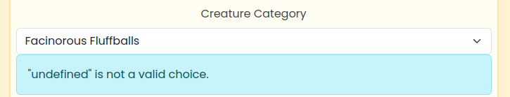

# **Creature Feature API - Testing**

## **Table of Contents (Testing):**

1. [**Testing Overview**](#testing-overview)
1. [**Testing Throughout Development**](#testing-throughout-development)
   - [**Manual Testing**](#manual-testing)
   - [**Automated Tests**](#automated-tests)
   - [**Noteworthy Bugs During Development**](#noteworthy-bugs-during-development)
1. [**Post Development Testing**](#post-development-testing)
   - [**Code Validation**](#code-validation)
   - [**Unresolved Bugs**](#unresolved-bugs)
1. [**User Story Testing**](#user-story-testing)
   - [**Navigation & Authentication**](#user-stories-navigation--authentication)
   - [**Creating & Editing Posts**](#user-stories-creating--editing-posts)
   - [**Viewing Posts**](#user-stories-viewing-posts)
   - [**Reactions**](#user-stories-reactions)
   - [**Comments**](#user-stories-comments)
   - [**Profiles**](#user-stories-profiles)

## **Testing Overview**

Below I have documented the testing undertaken throughout development for this respository's code.

For information on front-end testing, please follow the link to this project's [**_front end respository's TESTING.md document_**](https://github.com/emmacadavra/creature-feature-react/blob/main/TESTING.md).

## **Testing Throughout Development**

### **Manual Testing**

Throughout development, I used a variety of methods to test my API code as I went along, in particular using print statements (_a LOT of print statements!_) to help me identify not only exactly what code was being passed from one place to another, but also to discover where things were going wrong if things weren't working as intended. Using a print statement on each step of the code's journey in some cases really helped me solidify my understanding about how data is passed between functions, between models and views, and so on.

Whilst I was writing the API code, it was also very rare for me to be doing so without first having run the `python3 manage.py runserver` command, so that I could see exactly how my code was being returned by the API, and identify where some errors or conflicts may arise.

As the API is largely URL based, I often tested URL paths by entering incorrect URLs, or logging out/logging in as a different user to make sure that errors were handled correctly.

When working with both the back-end and the front-end, I was always sure to have my local server running, even when the front-end was accessing the deployed API, so that I could cross reference the objects being returned in each API call with what I was expecting to receive into my React app.

### **Automated Tests**

As part of the course content provided by Code Institute, we were introduced to automated testing in Python, and I have demonstrated some of this in the posts app's 'tests.py' file. These tests were to ensure that users could create and update their own posts, but that other users who did not own that post were not able to update or delete them.

I would have liked to experiment more with automated testing in this project, but due to the scale of the project I needed to devote as much time as possible to working on the project itself. In future I plan to take the time to learn more about automated testing so that I can really understand it and appreciate its value to projects such as this one.

### **Noteworthy Bugs During Development**

As this is the largest and most complex project I have worked on to date, it goes without saying that I faced a great many bugs throughout development. Some of these were the result of using newer versions of Frameworks than I was used to, or that were being used in the CI course content, and many of them were down to not connecting models to views correctly, or adding too many/too few fields into serializers. Additionally, although I have used Django before, I was new to Django REST at the start of this project and there were many occasions on which I thought I was experiencing a bug, but it was in fact just the way that the Django REST development server us presented.

For example, when testing the Post model, I found that the post status was always set to 'Draft' first, despite the default being 'Published'. The same thing occurred with image filters, where the default is 'normal' but the first option was always '1977'. It took me a while to get used to the fact that the first option in the dropdown on the back end was just the first item in the list, and it didn't reflect what I'd set as the default.

Aside from this, below are some of the noteworthy bugs I encountered throughout the development process.

#### Post Categories

I had a tremendous amount of trouble with the post categories in the early stages of development, due to conflicting (and sometimes outdated) information available about the best way to go about it.

Originally, I had set the post categories as a separate class outside of the Post model, as 'model.TextChoices' class, with each category being declared as a single-word variable assigned to the string I wanted to display in the front-end. However, I found that this was causing the string value to be collected as the data, and the variable to be displayed to the user (the opposite of what I was trying to achieve).

I then moved the category choices inside the Post model, still as a class, and found I had the same issue. Changing the contents to sets of tuples, and changing the model type to 'model.Model' appeared to work as intended, until I began fleshing out the front-end where I realised the same thing was happening again.

I fixed this by amending the tuples to contain the same string twice, matching the value in the front- and back-end.

Eventually I realised that, due to the changes I had made, I was unable to edit any posts with the 'Facinorous Fluffballs' category as it was set to the default, but existing posts showed 'fluffy' as their category:

For this, I used dBeaver to access to my database and amend the post categories manually, which fixed the issue.

#### Reactions

I came across quite a few bugs when trying to get Reactions right. Originally, even though I provided the choices from the start, I followed a similar pattern to categories in that I found myself in situations where the wrong things were being pulled through to the API. Once I had fixed that, the reactions were working, but I realised I'd only included a single 'count' field in the post view, so I was unable to pull through how many of each reaction there were - only how many there were in total. To fix this, I added individual count fields to the queryset.

Another bug relating to reactions was that, when attempting to filter posts by only ones a user had reacted to, I was still getting all posts in the list, regardless of whether or not I'd reacted to them. This bug was caused by me incorrectly adding `reactions__owner__profile` to the 'ordering_fields' in the post view, rather than the 'filterset_fields'.

Quite late into development, when testing the front-end reaction functionality, I came back to the API code to discover I had caused two more bugs relating to reactions. The first was that I was only collecting the reaction ID to send to the front-end, and it wasn't being specifically linked to the reaction type. I fixed this by adding the post serializer field 'current_user_reaction', and defining the 'get_current_user_reaction' function, which would return an object containing both the ID and the type.

Lastly, again in the view for posts, I discovered very late into development that I had forgotten to declare 'distinct=True' on each of the individual reaction counts. This caused a very peculiar bug, where a post could have 1 reaction, but if the same post had 3 comments, the reaction count in the front-end would update to reflect the same number as the comments, even though there was only 1 reaction stored in the database. Naturally this was fixed by adding this into each of the reaction type counts.

## **Post Development Testing**

### **Code Validation**

The two resources I used to validate my Python code were the VSCode extension 'Flake8', and the [**_Code Institute Python Linter_**](https://pep8ci.herokuapp.com/#).

The majority of this project's code came back without any issues, and where there were issues, they were all occasions on which a line was considered too long. However, these only occured in my main settings.py file, and some of the urls.py files. Looking into the matter, I found that it is advised not to shorted items in settings.py (especially where they have automatically been set by Django), and for some of the url files there seemed to be no way for me to cleanly shorten them.

Other than this, my code passes PEP8 guidelines.

### **Unresolved Bugs**

At this time, to the best of my knowledge, I am unaware of any unresolved bugs in the code within this repository.

## **User Story Testing**

The User Stories for this project can be accessed by following this link to [**_the front-end repository’s project board_**](https://github.com/users/emmacadavra/projects/5). Further information on these User Stories an be found in the separate [**_AGILE.md document_**](https://github.com/emmacadavra/creature-feature-react/blob/main/AGILE.md), also within the front-end repository. Below, I have detailed how I tested the User Stories that relate to the API, using the back end to test the functionality. These tests were completed with Debug mode set to 'True', in order to access Django REST's UI as well as detailed information about any errors that may occur.

### **User Stories: Authentication**

| **As a user I can create a new account so that I can access all the features for signed up users**                                                                                                                                                            | **Complete?** |
| :------------------------------------------------------------------------------------------------------------------------------------------------------------------------------------------------------------------------------------------------------------ | :-----------: |
| Create a new admin user profile by using the `createsuperuser` console command                                                                                                                                                                                |    &check;    |
| Log into the admin panel of the app to confirm that super user has been created successfully                                                                                                                                                                  |    &check;    |
| Run the API server and navigate to the /profiles endpoint to confirm the superuser has had a profile automatically created alongside the account                                                                                                              |    &check;    |
| _[After front-end UI has started being built]_ Click the 'Sign Up' button and create a standard account (not superuser) through Django AllAuth's /signup page. Repeat previous step to confirm that the account has been created, with a profile alongside it |    &check;    |

| **As a user I can sign in to the app so that I can access functionality for logged in users**                                                             | **Complete?** |
| :-------------------------------------------------------------------------------------------------------------------------------------------------------- | :-----------: |
| Using the command `python3 manage.py runserver`, log in to Django REST with superuser credentials                                                         |    &check;    |
| Navigate to the /posts API endpoint and confirm that the ability to create a post is now displayed after logging in, repeat with /comments and /reactions |    &check;    |
| Log out again and follow the previous step to confirm that these options do not appear for logged out users                                               |    &check;    |

### **User Stories: Creating & Editing Posts**

| **As a logged in user I can create posts so that I can feature my creatures!**                                                                                                                                                 | **Complete?** |
| :----------------------------------------------------------------------------------------------------------------------------------------------------------------------------------------------------------------------------- | :-----------: |
| Using the command `python3 manage.py runserver`, log in to Django REST with superuser credentials and navigate to /posts to create a new post                                                                                  |    &check;    |
| Test that all fields marked as required are functioning correctly and that error handling shows the correct error messages by attempting to create a post with no data, then no data in each required field one by one         |    &check;    |
| Create a post that contains data in all required fields to test whether Django REST redirects logged in user to a detail page (/posts/[post id]) containing all the correct post information, including the post's assigned ID |    &check;    |
| Navigate back to /posts to see the full Post List and confirm that the most recent post added is at the top of the list                                                                                                        |    &check;    |

| **As a logged in user, I can choose a category for my post so that users know which kind of creature I’m featuring!**                                          | **Complete?** |
| :------------------------------------------------------------------------------------------------------------------------------------------------------------- | :-----------: |
| When creating a post, the category drop down appears as part of the form to create the post                                                                    |    &check;    |
| The category selected is reflected in the detailed post data returned from the API and matches the information requested from the front-end to display propely |    &check;    |

| **As a logged in post owner I can edit my post title and description so that I can make corrections or update my post after it was created**                                                                                                                            | **Complete?** |
| :---------------------------------------------------------------------------------------------------------------------------------------------------------------------------------------------------------------------------------------------------------------------- | :-----------: |
| When looking at the detail view of a post, test that all fields marked as required are functioning correctly and that error handling shows the correct error messages by attempting to edit the post to contain no data, then no data in each required field one by one |    &check;    |
| Making sure all required fields contain data, edit the existing post and navigate to the post detail page (/posts/[post id]) to ensure the post now contains the edited data                                                                                            |    &check;    |
| Log out to confirm that posts can only be edited when the user is logged in                                                                                                                                                                                             |    &check;    |
| Log in as a different superuser, and navigate to the same post detail page to confirm that posts can only be edited by the user that created them                                                                                                                       |    &check;    |

### **User Stories: Viewing Posts**

| **As a user I can view all the most recent posts, ordered by most recently created first so that I am up to date with the newest content**                        | **Complete?** |
| :---------------------------------------------------------------------------------------------------------------------------------------------------------------- | :-----------: |
| Navigate to /posts to see a list of all posts in the order set by the Meta class in the Post model (newest first)                                                 |    &check;    |
| Create a new post to check that it appears at the top of the list when created                                                                                    |    &check;    |
| Edit an existing post that is not at the top of the list to ensure that it stays in the same place in the list after editing (rather than moving back to the top) |    &check;    |

| **As a user, I can search for posts with keywords, so that I can find the posts and user profiles I am interested in**                                                                                                     | **Complete?** |
| :------------------------------------------------------------------------------------------------------------------------------------------------------------------------------------------------------------------------- | :-----------: |
| Navigate to /posts to see the full list of posts, and click the 'Filters' button to check that all filters in the PostList API View are showing                                                                            |    &check;    |
| Enter search terms into the search bar to check it is working as expected, and that no posts display if the search doesn't match an existing post's title or category, or if it doesn't match a registered user's username |    &check;    |
| Perform a search combining different filters and search terms to confirm that users can search for things more specifically if they want to, for example using a search term but only for posts of a specific category     |    &check;    |

| **As a user, I can filter posts by category so that I can view posts featuring specific types of creature**                                          | **Complete?** |
| :--------------------------------------------------------------------------------------------------------------------------------------------------- | :-----------: |
| Navigate to /posts to see the full list of posts, and click the 'Filters' button to check that all filters in the PostList API View are showing      |    &check;    |
| Select each category filter individually to check it is working as expected, and that only posts with that category are showing in the list of posts |    &check;    |
| Edit a post's category and make sure that the post is only picked up by the updated category, not the one it was originally created with             |    &check;    |

| **As a logged in user, I can view the posts I have reacted to so that I can revisit the posts I enjoy the most**                                                                                                                                                                                                                                                  | **Complete?** |
| :---------------------------------------------------------------------------------------------------------------------------------------------------------------------------------------------------------------------------------------------------------------------------------------------------------------------------------------------------------------- | :-----------: |
| _[After one or more post reactions have been created]_ When viewing the list of all posts, select the fourth Field Filter option, `reactions__owner__profile` (Django REST displays this as '[invalid name]', which is a known bug with Django REST) and select a superuser to check that the updated post list only contains posts that superuser has reacted to |    &check;    |
| Create new reactions, and delete existing reactions to ensure that the list continues to pull through the correct data                                                                                                                                                                                                                                            |    &check;    |

| **As a logged in user I can view content filtered by users I follow so that I can keep up to date with what they are posting about**                                                                                                                                                                                                                                                               | **Complete?** |
| :------------------------------------------------------------------------------------------------------------------------------------------------------------------------------------------------------------------------------------------------------------------------------------------------------------------------------------------------------------------------------------------------- | :-----------: |
| _[After logging in and following one or more profiles]_ When viewing the list of all posts, select the third Field Filter option, `owner__followed__owner__profile` (Django REST displays this as '[invalid name]', which is a known bug with Django REST) and select a superuser to check that the updated post list only contains posts that have been made by users that superuser is following |    &check;    |
| Follow and unfollow different users to check that the list updates correctly when the filter is applied                                                                                                                                                                                                                                                                                            |    &check;    |

### **User Stories: Reactions**

| **As a logged in user, I can react to a post with clear visual feedback that I have done so, so that I know how I have reacted and understand I can only pick one**                                                                                                     | **Complete?** |
| :---------------------------------------------------------------------------------------------------------------------------------------------------------------------------------------------------------------------------------------------------------------------- | :-----------: |
| When logged in as a superuser, navigate to the /reactions API endpoint, and select a post to react to as well as a reaction type - check that a new reaction is created and that the API displays a detail view of the reaction once created, including its assigned ID |    &check;    |
| Check the reactions list to ensure the new reaction has been added to the top of the list                                                                                                                                                                               |    &check;    |
| Attempt to react to the same post again as the same logged in superuser, with the same reaction as well as a different one, to ensure error handling is working correctly and displaying the correct message                                                            |    &check;    |
| Navigate to the post's detail view (/posts/[post id]) to check that the count for the selected reaction type has increased by 1                                                                                                                                         |    &check;    |
| Log out to confirm that the option to react to posts is only available for logged in users                                                                                                                                                                              |    &check;    |

| **As a logged in user, I can click/tap again on a reaction to undo it, with clear visual feedback that I have done so, so that I can choose a different reaction if I change my mind**                                                        | **Complete?** |
| :-------------------------------------------------------------------------------------------------------------------------------------------------------------------------------------------------------------------------------------------- | :-----------: |
| When logged in as a superuser, navigate to the detail view for the reaction (/reactions/[reaction id]), and change the reaction type to something different - check the detail view to make sure it has updated correctly                     |    &check;    |
| Check the reactions list to ensure the new reaction type has been recorded                                                                                                                                                                    |    &check;    |
| Navigate to the post's detail view (/posts/[post id]) to check that the count for the updated reaction type has increased by 1, and that the count for the original reaction type has decreased by 1                                          |    &check;    |
| Navigate back to the detail view for the reaction and delete it, repeating previous steps to ensure it is removed from the reactions list, and that the post's count for that reaction type has decreased by 1                                |    &check;    |
| Create a new reaction for the same post to confirm that users are able to delete and then re-create reactions at will                                                                                                                         |    &check;    |
| Test that reactions can only be updated/deleted by the user who created them by navigating to the reaction's detail view when logged out, and when logged in as a different superuser, to confirm the update & delete options are not visible |    &check;    |

### **User Stories: Comments**

| **As a logged in user I can add comments to a post so that I can share my thoughts about the post**                                                                                                                           | **Complete?** |
| :---------------------------------------------------------------------------------------------------------------------------------------------------------------------------------------------------------------------------- | :-----------: |
| When logged in as a superuser, navigate to the /comments API endpoint, and select a post to comment on - enter a comment and check that the API displays a detail view of the comment once created, including its assigned ID |    &check;    |
| Attempt to add an empty comment to make sure that error handling is working correctly and that users cannot leave empty comments                                                                                              |    &check;    |
| View the comments list and check that the new comment appears at the top of the list (newest comments first)                                                                                                                  |    &check;    |
| Navigate to the post's detail page and check that the comment count has increased by 1 for every comment left                                                                                                                 |    &check;    |
| Log out to ensure that the option to leave a comment is only available for logged in users                                                                                                                                    |    &check;    |

| **As a logged in owner of a comment I can edit my comment so that I can fix or update my existing comment**                                                                                                                | **Complete?** |
| :------------------------------------------------------------------------------------------------------------------------------------------------------------------------------------------------------------------------- | :-----------: |
| When logged in as a superuser, navigate to the detail view of the comment (/comments/[comment id]), and edit the content - check that the content is updated in the detail view                                            |    &check;    |
| Check that error handling is working correctly by attempting to update the comment to be empty, to check the correct error message appears                                                                                 |    &check;    |
| Navigate to the post's detail page to check that the comment count remains the same, and does not increase every time the comment is amended                                                                               |    &check;    |
| Test that comments can only be updated by the user who created them by navigating to the comments's detail view when logged out, and when logged in as a different superuser, to confirm the option to edit is not visible |    &check;    |

| **As a logged in owner of a comment I can delete my comment so that I can control removal of my comment from the application**                                                                                               | **Complete?** |
| :--------------------------------------------------------------------------------------------------------------------------------------------------------------------------------------------------------------------------- | :-----------: |
| When logged in as a superuser, navigate to the detail view of the comment (/comments/[comment id]), and delete the content - check that the record is removed from the comment list view                                     |    &check;    |
| Navigate to the post's detail page to check that the comment count is decreased by 1                                                                                                                                         |    &check;    |
| Test that comments can only be deleted by the user who created them by navigating to the comments's detail view when logged out, and when logged in as a different superuser, to confirm the option to delete is not visible |    &check;    |

| **As a logged in user I can like the comments of other users so that I can show support or agreement as to what other users have to say**                                                                                           | **Complete?** |
| :---------------------------------------------------------------------------------------------------------------------------------------------------------------------------------------------------------------------------------- | :-----------: |
| When logged in as a superuser, navigate to the /likes API endpoint and select a comment to like, checking that the API displays a detail view of the like once created, including its assigned ID                                   |    &check;    |
| Check that error handling is working correctly by attempting to like the same comment again as the same user, to check the correct error message appears                                                                            |    &check;    |
| Navigate to the detail view for the comment (/comments/[comment id]) and confirm that the likes count has increased by 1                                                                                                            |    &check;    |
| Navigate back to the detail view for the like (/likes/[like id]) and delete the like, checking that the record is removed from the list of likes and that the comment's like count has decreased by 1 in the comment detail view    |    &check;    |
| Test that comment likes can only be deleted by the user who created them by navigating to the detail view for the like when logged out, and when logged in as a different superuser, to confirm the option to delete is not visible |    &check;    |

### **User Stories: Profiles**

| **As a user I can see a list of the most followed profiles so that I can see which profiles are popular** | **Complete?** |
| :-------------------------------------------------------------------------------------------------------- | :-----------: |
| TEST                                                                                                      |    &check;    |
| TEST                                                                                                      |    &check;    |
| TEST                                                                                                      |    &check;    |

| **As a logged in user I can follow and unfollow other users so that I can see and remove posts by specific users in my posts feed** | **Complete?** |
| :---------------------------------------------------------------------------------------------------------------------------------- | :-----------: |
| TEST                                                                                                                                |    &check;    |
| TEST                                                                                                                                |    &check;    |
| TEST                                                                                                                                |    &check;    |

| **As a logged in user I can edit my profile so that I can change my profile picture and bio** | **Complete?** |
| :-------------------------------------------------------------------------------------------- | :-----------: |
| TEST                                                                                          |    &check;    |
| TEST                                                                                          |    &check;    |
| TEST                                                                                          |    &check;    |

Please click the following link to return to the [**_README.md_**](README.md) document.
